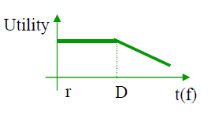
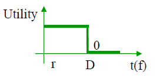
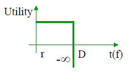

# Real Time Systems

Real time expresses the dependency of a computing system with respect to time as imposed by a physical or logical external process.
A real time system is able to keep the pace of a process and influence it in a desired way. The most important aspects of a real time system are 
* Execution time of the components
  * Code Structure
  * Operating System or kernel
  * DMA, caches, instructions pipeline
* Response time and regularity of generating periodic events
  * Multi-tasking
  * Acess to shared resources
  * Hardware interrupts

Requirements of Real time Systems are
* Functional (acquiring environment data, direct digital control and human machine interface)
* Temporal
* Dependability

Temporal requirements sets constraints that must be met in all instances

Real Time **constraints** can be:

* Soft - Time contraint according to which the associated value **keeps some utility** to the application even after a deadline D, despite a possible degradation of the quality of service
 

* Firm - Time constraint according to which the associated value **loses any utility** to the application after a deadline D

* Hard - Time constraint that, when not met, may generate a **catastrophic failure**

Real Time **systems** can be:

* Soft Real Time - There are **firm** or **soft** time constraints only
* Hard Real Time - There is at least one **hard** time constraint. These are safety-critical systems.

Real time systems are used in critical applications, thus having a specific requirement: high reliability. These aplications can be categorized has having **critical safety**: 

* They have **stable interfaces** between the critical and non-critical subsystems in order to prevent error propagation.
* **Well defined worst-case scenarios**, in which the system must possess the **adequate resources** to withstand a worst-case operational scenario without the need for probabilistic arguments and should provide service guarantees even in such cases
* **Architecture** composed by **autonomous subsystems**, whose properties can be verified independently from the other subsystems
