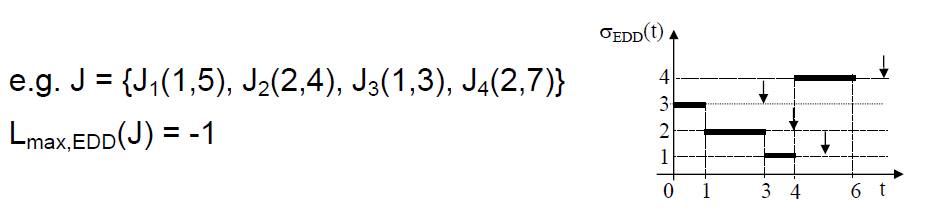

### Basic Scheduling concepts

**Task scheduling** is a sequence of tasks execution in one or more processors. It is generally represented in a Gantt chart.

A **scheduling algorithm** is a method to solve a scheduling problem.

* **EDD - Earliest Due Date**
Single job tasks and triggered synchronously.

Lmax(J) = max_i(f_i - d_i)
O(n*log(n))

J3 é o primeiro a ser executado pois é o que tem menor due date. De seguida J2, J1, e J4.

* **EDF - Earliest Deadline First**
Periodic tasks, asynchronous, preemptive

Lmax(J) = max_i(f_i - d_i)
O(n*log(n))

J1 é o primeiro a ser executado pois é o que tem menor activation time. De seguida J2 começa a ser executado, mas como J3 tem como activation time 2 e due date 3, J2 é interrompido para executar J3. De seguida, retoma-se J2 e por fim, J4. J2 e J4 têm o mesmo activation time, mas como J2 tem um due date menor, é executado primeiro.
